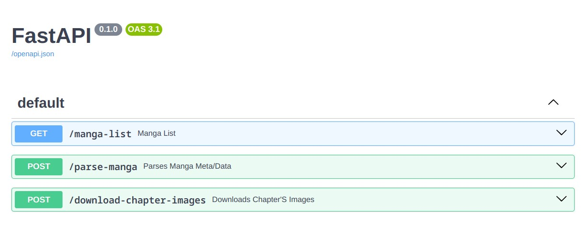
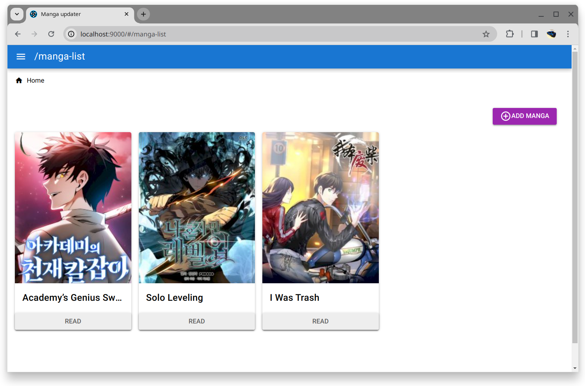
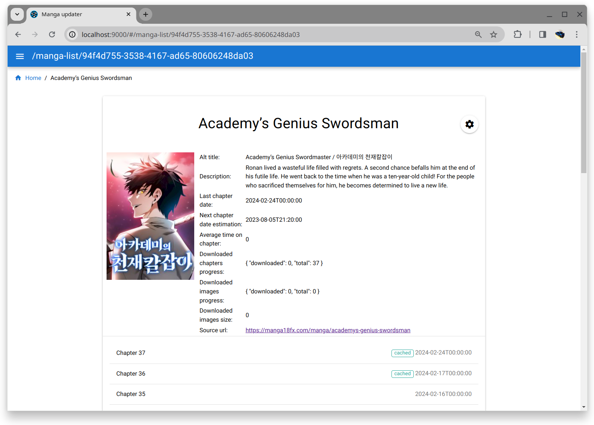
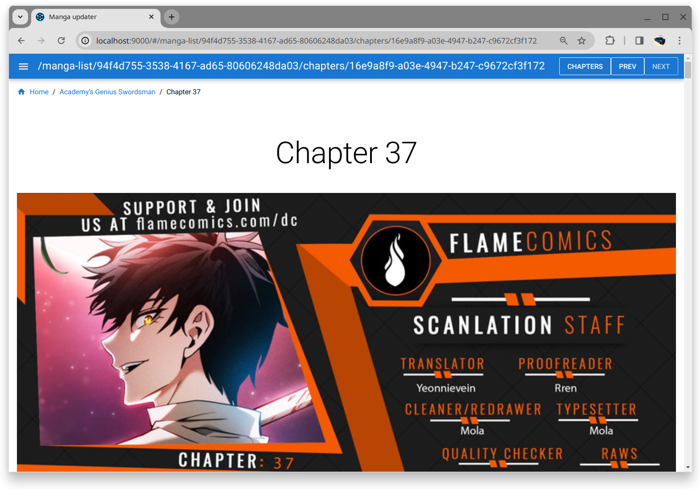

# manga-updater

*⚠️ EXPERIMENTAL For private usage only. Author doesn't guarantee any future maintenance, releases or breaking changes. Feel free to fork it.*

**manga-updater** is an eventloop-based manga scrapper/updater app

## Features

- parse external sites (supports: manga18fx)
- save/load app's state:
    - manga_list - *list of parsed manga*
    - monitoring_list - *list of observed manga to keep it up-to-date*
    - download_deque - *chapters queued for caching content/images*
    - task_queue - *event-bus (currently there are two possible actions/events: "monitor-manga" and "download-chapter")*
- stats calculation
    - nextChapterDateEst - *date estimation for next chapter*
    - ...


## Technical details

Server side built on:
- fastapi/uvicorn/asyncio
- beautifulsoap4 (https://www.crummy.com/software/BeautifulSoup/)
- msgspec (de-serialization)
- structlog/rich

Client side built on:
- Vue3 / Vue-router
- Quasar2 (components) / Quasar CLI (uses Vite under-the-hood)

### Server

Manga-updater's core is a event-loop based server. Server supports:
- parse external manga page data
- persist parsed data on disk
- download chapter's content as images
- return persisted data via REST API



### Client

Manga-updater comes with web-based client in form of SPA. It was built in a hurry (so codebase is a mess with coupled logic), but it solves personal needs.

#### Home page (List)



#### Manga page



#### Chapter page



## Development

Deps:
- Python 3.10+

Run server
```bash
# Proxy  on 7777
# Server on 8000
bash dev.sh
```

Deps:
- [cors-anywhere](https://github.com/Rob--W/cors-anywhere)
- Node LTS 20.x.x or above
- VS Code Extensions (check [SETUP.HISTORY.md](./frontend/SETUP.HISTORY.md))

Run client
```bash
cd frontend
npx quasar dev
```

## Dependencies / Credits

Backend
- [Fastapi](https://github.com/tiangolo/fastapi) - MIT
- [beautifulsoap4](https://www.crummy.com/software/BeautifulSoup/) - MIT
- [uvicorn](https://github.com/encode/uvicorn) - BSD-3-Clause
- [msgspec](https://github.com/jcrist/msgspec) - BSD-3-Clause
- [httpx](https://github.com/encode/httpx/) - BSD-3-Clause
- [structlog](https://github.com/hynek/structlog/) - Apache-2.0
- [rich](https://github.com/Textualize/rich) - MIT

Client
- [vue](https://github.com/vuejs/core) - MIT
- [vue-use](https://github.com/vueuse/vueuse) - MIT
- [quasar](https://github.com/quasarframework/quasar) - MIT

---
<div style="text-align: right">MIT</div>